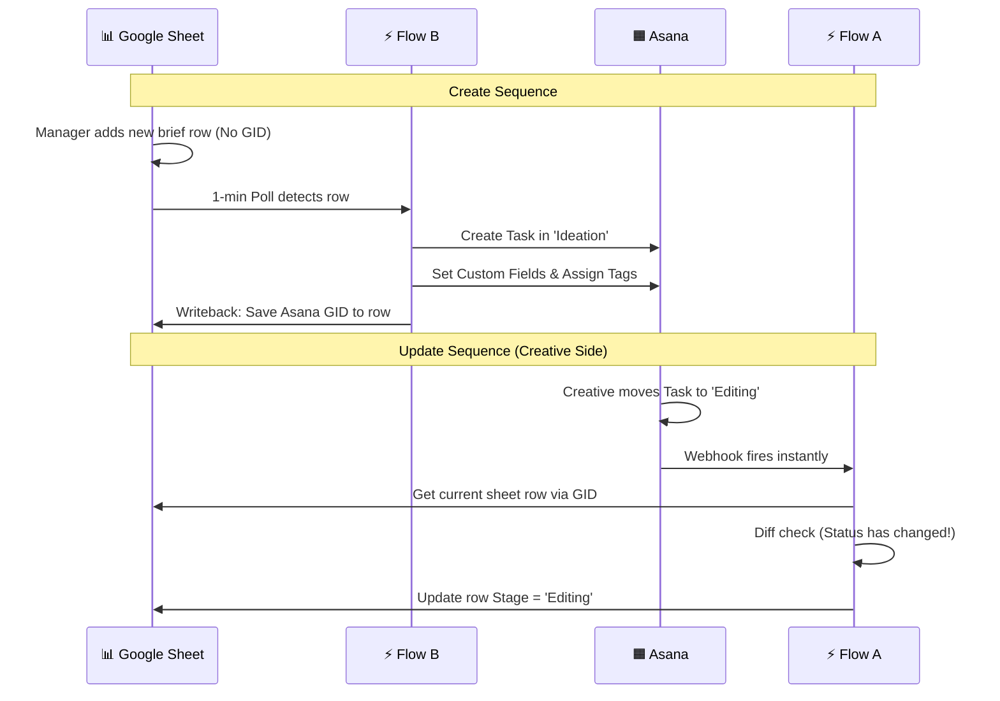

<div align="center">


<br/>


&nbsp;

&nbsp;

&nbsp;

&nbsp;


</div>

---

## 📌 What Is This?

**Asana ⇄ Google Sheets Sync** is a robust, bidirectional data integration built in **n8n** for a high-velocity creative ad production team. It ensures that an **Asana project board** and a **Google Sheet ("CREATIVE ROADMAP")** remain perfectly tethered across four pipeline stages (`Ideation`, `Filming`, `Editing`, `Advertising`).

When tasks are shifted in Asana, instant webhooks fire and a smart diffing engine updates the spreadsheet. Conversely, when bulk rows are added or edited in Google Sheets, an autonomous polling job catches the changes, computes dynamic deadlines, provisions new Asana tasks, updates custom fields, and loops the IDs back into the database.

> Zero manual data entry. Zero infinite loop-backs. Maximum pipeline velocity.

---

## 🧭 System Overview — 2 Scenarios

| Scenario | Trigger | Role |
|:---|:---|:---|
| **Flow A** — Asana → Excel | Asana Webhook (Instant) | Detects stage/field changes, diffs payload, updates sheet silently |
| **Flow B** — Excel → Asana | Google Sheets Poll (60s) | Detects row changes, routing to Create Task or Update Task paths |

---

## 📸 Workflow Dashboards

<details open>
<summary><strong>👉 Flow A: Asana → Excel Engine</strong></summary>

<br>

<!-- ============================================== -->
<!-- 💡 DRAG AND DROP YOUR "ASANA TO EXCEL" WORKFLOW IMAGE HERE 👇 -->
<!-- ============================================== -->


<!-- ============================================== -->

<br>

</details>

<details open>
<summary><strong>👉 Flow B: Excel → Asana Engine</strong></summary>

<br>

<!-- ============================================== -->
<!-- 💡 DRAG AND DROP YOUR "EXCEL TO ASANA" WORKFLOW IMAGE HERE 👇 -->
<!-- ============================================== -->


<!-- ============================================== -->

<br>

</details>

---

## ⚡ Full System Architecture

```mermaid
flowchart TD
    subgraph ASANA_TO_SHEET ["Flow A: Asana → Sheets (Instant)"]
        WH["⚡ Asana Webhooks\n(Ideation, Filming,\nEditing, Ads)"] --> CODE1
        CODE1["🧠 Code\nRecursively extract\ndeepest Task GID"] --> GET_T
        GET_T["📥 Get a task\nFetch full payload"] --> GET_S
        GET_S["📊 Get row in sheet\nLook up by Asana GID"] --> CODE2
        CODE2["🧠 Code\nExtract Drive + Doc URLs"] --> IF1
        
        IF1{"🔀 IF Gate\n10-Field Diff Check\nDid anything actually change?"}
        IF1 -- "✅ Yes" --> UP1
        IF1 -- "❌ No" --> STOP1(["🚫 Skip Write"])
        UP1["📊 Update row in sheet\nSync Status, Priority,\nFields & Editor tags"]
    end

    subgraph SHEET_TO_ASANA ["Flow B: Sheets → Asana (Every 1 min)"]
        WATCH["⏰ Watch Rows\nPoll A1:Z1000"] --> IF2
        
        IF2{"🔀 Check GID\nDoes Asana GID exist?"}
        IF2 -- "❌ Empty (CREATE)" --> DUE
        IF2 -- "✅ Exists (UPDATE)" --> UP_TASK
        
        subgraph CREATE_PATH ["🚨 Create Path"]
            DUE["📅 Due Date calc\n(Set to upcoming Friday)"] --> CREATE1
            CREATE1["➕ Create a Task\nin Ideation Project"] --> UP_CF1
            UP_CF1["📝 Update Custom Fields\n(Type, Launch Priority, etc)"] --> UP_TAGS1
            UP_TAGS1["🏷️ Add Task Tags\n(Assign Author & Editor)"] --> WRITEBACK
            WRITEBACK["📊 Writeback to sheet\nSave new GID to row"]
        end
        
        subgraph UPDATE_PATH ["✏️ Update Path"]
            UP_TASK["✏️ Update a Task\n(Sync Notes & URLs)"] --> UP_CF2
            UP_CF2["📝 Update Custom Fields\n(via REST API)"] --> UP_TAGS2
            UP_TAGS2["🏷️ Update Task Tags"]
        end
    end

    style WH fill:#F06A6A,color:#fff,stroke:#c24b4b
    style WATCH fill:#34A853,color:#fff,stroke:#26853f
    style CODE1 fill:#1e3a5f,color:#fff,stroke:#112540
    style CODE2 fill:#1e3a5f,color:#fff,stroke:#112540
    style DUE fill:#1e3a5f,color:#fff,stroke:#112540
    style GET_T fill:#F06A6A,color:#fff,stroke:#c24b4b
    style UP_TASK fill:#F06A6A,color:#fff,stroke:#c24b4b
    style CREATE1 fill:#F06A6A,color:#fff,stroke:#c24b4b
    style UP_CF1 fill:#3b82f6,color:#fff,stroke:#2b63be
    style UP_CF2 fill:#3b82f6,color:#fff,stroke:#2b63be
    style UP_TAGS1 fill:#3b82f6,color:#fff,stroke:#2b63be
    style UP_TAGS2 fill:#3b82f6,color:#fff,stroke:#2b63be
    style GET_S fill:#34A853,color:#fff,stroke:#26853f
    style UP1 fill:#34A853,color:#fff,stroke:#26853f
    style WRITEBACK fill:#34A853,color:#fff,stroke:#26853f
    style IF1 fill:#f59e0b,color:#fff,stroke:#d18300
    style IF2 fill:#f59e0b,color:#fff,stroke:#d18300
    style STOP1 fill:#444,color:#fff,stroke:#333
```

<div align="center">



</div>

---

## 🔗 Scenario-by-Scenario Breakdown

### 🅰️ Flow A — Asana to Google Sheets

**Trigger:** Any change inside the four watched Asana Sections fires an instant webhook.

#### Node Flow

```
Asana Webhooks (x4 Projects)
    ↓
[CODE NODE] getLastGid(payload)
    Extracts the deeply nested 'gid' from the raw webhook payload
    ↓
Get a task (Asana API)
    ↓
Get row(s) in sheet (CREATIVE ROADMAP)
    key = "Asana Task GID"
    ↓
[CODE NODE] Extract Notes
    Parses 'Brief URL' and 'DRIVE_URL' via regex from Task Notes
    ↓
[SMART DIFF FILTER] → 🔀 OR Logic on 10 fields!
    ├── IF changed (Brief #, Editor, Status, Priority, Type...) ──→ Update Sheet
    └── IF NO CHANGE ──────────────────────────────────────────────→ 🚫 STOP
```

> **Why the Smart Diff?** If we write to the Google Sheet blindly on *every* Asana event, the Google Sheet update will instantly re-trigger Flow B, causing an infinite sync loop. The Diff filter prevents ghost-triggers.

---

### 🅱️ Flow B — Google Sheets to Asana

**Trigger:** `Watch Rows` polling node hits the `A1:Z1000` range every 60 seconds.

#### Node Flow

```
Watch Rows (Google Sheets Trigger)
    ↓
[FILTER] Asana Task GID empty?
    ├── EMPTY ──────────────────────────────────────────────→ Create Path
    └── EXISTS ─────────────────────────────────────────────→ Update Path
```

#### Create Path

```
1. Calculate Due Date (Code Node)
   Mon-Thu → This incoming Friday
   Fri-Sun → Next week's Friday
   
2. Create a Task (Asana)
   Workspace: 1210018926299426
   Project: Ideation
   Properties: Includes Name, Due Date, and URLs in Notes

3. Map & Update Custom Fields (HTTP Request)
   Updates Enums: Type, # of IT, Format, Ad Concept, Launch Priority

4. Add Task Tags
   Matches Author and Editor tags dynamically

5. Writeback to Sheet
   Updates the source row with the newly minted `Asana Task GID` (Key linkage)
```

#### Update Path
Mirrors the creation logic but executes a `PUT` request to update existing task data instead of creating a new unified entity. It updates notes, custom Enums, and re-attaches any changed personnel tags.

---

## 📊 Data Mapping Schema

The system acts as a translator between Asana's Graph/Enums and Flat-Sheet columns.

| Google Sheet Column | Asana Equivalent | Data Type |
| :--- | :--- | :--- |
| `Brief #` | Task Name | Text |
| `Status` | Section Name | Stage / Enum |
| `Type` | Custom Field `[0]` | Enum |
| `# of IT` | Custom Field `[1]` | Enum |
| `Format` | Custom Field `[2]` | Enum |
| `LP` | Custom Field `[3]` | Text |
| `Ad Concept` | Custom Field `[4]` | Text |
| `Launch Priority` | Custom Field `[5]` | Integer |
| `Author` | Task Tag `[0]` | Tag |
| `Editor` | Task Tag `[1]` | Tag |
| `Brief URL` | Task Notes (Line 1) | URL |
| `DRIVE_URL` | Task Notes (Line 2) | URL |
| `Asana Task GID` | Task Global ID | **Primary Key** |

---

## 🔄 End-to-End Sequence



---

## 🛠️ Tech Stack

<div align="center">

| Tool | Role |
|:---|:---|
|  | Core orchestration engine (Webhooks + Crons) |
|  | Project Management Board & Extensible API |
|  | Creative Roadmap & flat-file primary database |
|  | Direct PUT requests for Enum custom field mapping |
|  | Custom node logic, recursion, and diff checks |

</div>

---

## 🚀 Setup Guide

### Prerequisites
- [ ] Active n8n environment
- [ ] Asana Developer App (OAuth2)
- [ ] Google Cloud Console App (Sheets API & Picker API enabled)
- [ ] A copy of the `CREATIVE RESEARCH [L-CART]` spreadsheet structure.

### Activation Steps
1. **Import Workflows:** Import `Asana to Excel.json` and `Excel to Asana.json` into n8n.
2. **Credentials Setup:** Connect Asana OAuth2, Google Sheets OAuth2, and Google Sheets Trigger OAuth2.
3. **Map the Database:** Inside the Sheets nodes, ensure the targeted Document ID targets your specific spreadsheet hash (`1fP2DpH7...`). 
4. **Boot Sequence:**
   - Turn **ON** `Asana to Excel` first (Initializes Webhook Listeners).
   - Turn **ON** `Excel to Asana` second (Starts the 1-minute sweeping process).

> **Note:** The n8n instance handles custom Enum field mapping through raw `HTTP Request` nodes hitting the Asana REST payload endpoints directly.

---

<div align="center">

**Built by [Abdul Rehman](https://github.com/ar-rehman786)**

[](mailto:abdulrehmanhameed4321@gmail.com)
&nbsp;
[](https://www.sloraai.com/)
&nbsp;
[](https://github.com/ar-rehman786)

</div>


