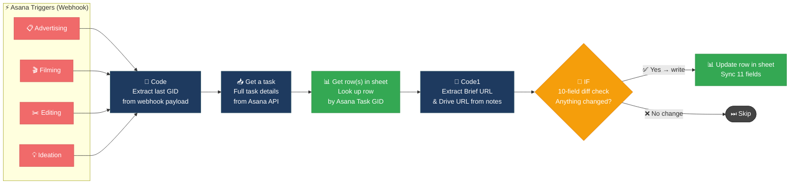
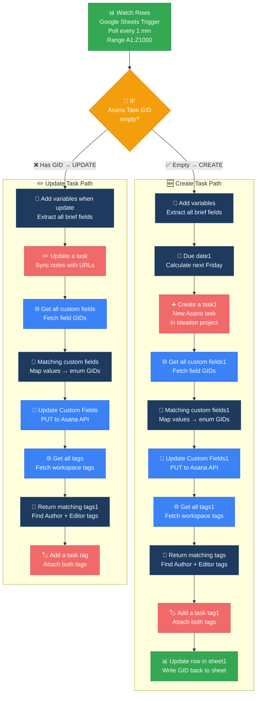
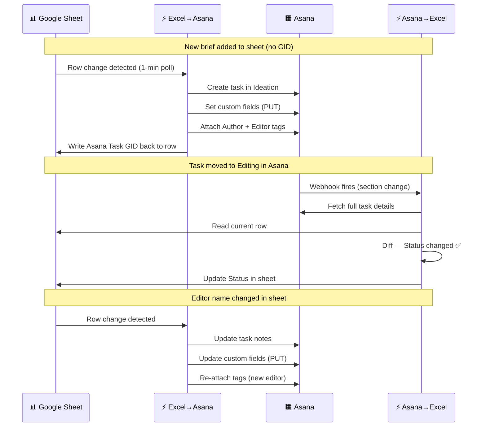

<div align="center">


<br/>


&nbsp;

&nbsp;

&nbsp;

&nbsp;


</div>

---

## Overview

Two n8n workflows that keep an Asana project board and a **Google Sheet ("CREATIVE ROADMAP")** in perfect sync — automatically, in both directions. Changes in Asana reflect in the sheet within seconds. Changes in the sheet create or update Asana tasks within a minute — without human intervention.

Built for a creative ad production team managing briefs across four pipeline stages: **Ideation → Filming → Editing → Advertising**.

---

## How the Two Workflows Fit Together

```
┌─────────────────────────────────────────────────────────────────┐
│                      CREATIVE ROADMAP                           │
│                       Google Sheet                              │
└──────────────┬──────────────────────────┬───────────────────────┘
               │  Excel → Asana           │  Asana → Excel
               │  (row change detected)   │  (task event webhook)
               ▼                          ▲
┌─────────────────────────────────────────────────────────────────┐
│   Ideation  │  Filming  │  Editing  │  Advertising   (Asana)   │
└─────────────────────────────────────────────────────────────────┘
```

| Workflow | Direction | Trigger | Primary Action |
|:---|:---|:---|:---|
| **Asana → Excel** | Asana → Sheet | Webhook (instant) | Update existing row when task fields change |
| **Excel → Asana** | Sheet → Asana | Poll every 1 min | Create new task or update existing one |

---

## 🖼️ Workflow Screenshots

<details>
<summary><strong>📊 Workflow 1 — Asana → Excel</strong> &nbsp;(click to expand)</summary>

<br/>

> 4 Asana triggers fan in → Code → Get a task → Read sheet row → Diff check → Update row


</details>

<details>
<summary><strong>📋 Workflow 2 — Excel → Asana</strong> &nbsp;(click to expand)</summary>

<br/>

> Watch Rows → IF (create vs update) → variables → Due date → Create/Update task → Custom fields → Tags → Write GID back


</details>

---

## Workflow 1 — Asana → Excel

> *"Any time a task changes in Asana, the sheet row is updated automatically."*

### Architecture



### Node-by-Node

#### 1 · Asana Triggers (×4)

Four separate webhook listeners — one per Asana project section. All feed into the same downstream pipeline.

| Trigger Node | Asana Project GID | Stage |
|:---|:---|:---|
| **Advertising** | `1211025036975704` | Final stage — ready to launch |
| **Filming** | `1210018922107046` | Content capture in progress |
| **Editing** | `1211025036975701` | Post-production |
| **Ideation** | `1211025036975698` | Brief writing & concept |

#### 2 · Code — Extract GID

The webhook payload is a nested object. This JavaScript recursively walks it to find the **deepest `gid`** value — the actual task ID that changed.

```js
function getLastGid(o) {
  let lastGid = null;
  for (const key of Object.keys(o)) {
    const value = o[key];
    if (value && typeof value === 'object' && !Array.isArray(value)) {
      lastGid = getLastGid(value); // recurse
    }
  }
  if (o.gid) lastGid = o.gid;
  return lastGid;
}
```

#### 3 · Get a task

Fetches full task detail from the Asana API using the extracted GID. Returns tags (Author, Editor), custom fields, section name (Status), and notes.

#### 4 · Get row(s) in sheet

Looks up the corresponding row in **CREATIVE ROADMAP** sheet, matched on `Asana Task GID` column.

#### 5 · Code1 — Extract URLs from Notes

Task notes store two URLs on separate lines. This regex pulls them out:

```
notes format:
1. https://docs.google.com/... (Brief URL)
2. https://drive.google.com/... (Drive URL)
```

#### 6 · IF — Smart Diff Gate (10 conditions, OR logic)

Only writes to the sheet if **at least one field has changed**. Compares:

| # | Sheet Column | Asana Source |
|:---|:---|:---|
| 1 | `Brief #` | `task.name` |
| 2 | `Editor` | `task.tags[1].name` |
| 3 | `Status` | `task.memberships[0].section.name` |
| 4 | `# of IT` | `custom_fields[1].display_value` |
| 5 | `Type` | `custom_fields[0].display_value` |
| 6 | `LP` | `custom_fields[3].display_value` |
| 7 | `Ad Concept` | `custom_fields[4].display_value` |
| 8 | `Launch Priority` | `custom_fields[5].display_value` (numeric) |
| 9 | `Brief URL` | First URL extracted from notes |
| 10 | `DRIVE_URL` | Second URL extracted from notes |

> If nothing changed (e.g. Asana fired an unrelated event), the row is silently skipped.

#### 7 · Update row in sheet

Writes all 11 synced fields to the matched row: `Status`, `Brief #`, `Author`, `Editor`, `# of IT`, `LP`, `Ad Concept`, `Launch Priority`, `Type`, `Format`, `Asana Task GID`.

---

## Workflow 2 — Excel → Asana

> *"New rows in the sheet become Asana tasks. Edited rows update existing tasks. Custom fields and tags are synced precisely."*

### Architecture



### Node-by-Node

#### 1 · Watch Rows

Polls the **CREATIVE ROADMAP** sheet every minute for any row updates within `A1:Z1000`. Fires once per changed row.

#### 2 · IF — Create vs. Update

| Condition | Branch |
|:---|:---|
| `Asana Task GID` is **empty** | → Create new task |
| `Asana Task GID` is **present** | → Update existing task |

#### Create Path

**`Due date1`** — Calculates the deadline as **next Friday**:

```
Monday–Thursday  → this coming Friday
Friday           → the following Friday (+7)
Saturday         → next Friday (+6)
Sunday           → next Friday (+5)
```

**`Create a task1`** — Creates the task in the **Ideation** project with:
- Name = `Brief #`
- Notes = URL 1 + URL 2 from sheet
- Due date = computed Friday

**Custom Fields Pipeline (Create)**
```
Get all custom fields1  →  Matching custom fields1  →  Update Custom Fields1
(fetch enum GIDs)           (match text → GID)          (PUT to Asana API)
```
Maps 6 custom fields: `Type`, `# of IT (Variation)`, `Format`, `LP`, `Ad Concept`, `Launch Priority`

**Tags Pipeline (Create)**
```
Get all tags1  →  Return matching tags  →  Add a task tag1
(all tags)         (filter Author + Editor)   (attach both)
```

**`Update row in sheet1`** — Writes the new `Asana Task GID` back to the sheet, permanently linking the row ↔ task.

#### Update Path

**`Update a task`** — Updates task notes with current `Brief URL` and `DRIVE_URL` from sheet.

Then runs the same **custom fields** and **tags** pipeline as the Create path, keeping Asana in sync with any edits made directly in the sheet.

---

## Data Schema

### Google Sheet Columns (CREATIVE ROADMAP)

| Column | Source | Notes |
|:---|:---|:---|
| `Brief #` | Task name | e.g. `B5/AYB14` |
| `Author` | Tag 0 on task | Person who wrote the brief |
| `Editor` | Tag 1 on task | Person editing the video |
| `Status` | Section name | Pipeline stage |
| `# of IT` | `custom_fields[1]` | Iteration / variation count |
| `Type` | `custom_fields[0]` | Content type |
| `Format` | `custom_fields[2]` | e.g. `RV` (Reels Video) |
| `LP` | `custom_fields[3]` | Landing page |
| `Ad Concept` | `custom_fields[4]` | Creative concept |
| `Launch Priority` | `custom_fields[5]` | Number (1–5) |
| `Brief URL` | Task notes line 1 | Google Doc link |
| `DRIVE_URL` | Task notes line 2 | Google Drive folder |
| `Asana Task GID` | Created by workflow | Foreign key linking row ↔ task |
| `UUID` | Sheet-generated | Used to match row on creation |

### Custom Field ID Mapping (Asana workspace `1210018926299426`)

| Index | Field Name | Type |
|:---|:---|:---|
| `[0]` | Type | Enum |
| `[1]` | Variation (# of IT) | Enum |
| `[2]` | Format | Enum |
| `[3]` | Landing Page (LP) | Text |
| `[4]` | Ad Concepts | Text |
| `[5]` | Launch Priority | Enum |

---

## Sync Sequence — End to End



---

## Tech Stack

<div align="center">

| Tool | Role |
|:---|:---|
|  | Workflow orchestration |
|  | Project management + webhook triggers |
|  | Creative roadmap data store |
|  | Custom field + tag updates (direct PUT) |
|  | GID extraction, URL parsing, enum matching |

</div>

---

## Setup Guide

### Prerequisites

- [ ] n8n instance (self-hosted or cloud)
- [ ] Asana OAuth2 credentials configured in n8n
- [ ] Google Sheets OAuth2 credentials configured in n8n  
- [ ] Google Sheets Trigger OAuth2 credentials configured in n8n
- [ ] A copy of the CREATIVE RESEARCH [L-CART] spreadsheet

### Credentials Required

| Credential | Used by |
|:---|:---|
| `Asana account` (OAuth2) | Asana triggers, task read/write, tag operations |
| `Google Sheets account` (OAuth2) | Sheet read/update operations |
| `Google Sheets Trigger account` (OAuth2) | Watch Rows polling trigger |

### Configuration Steps

1. **Import both workflow JSONs** into n8n
2. **Connect credentials** — Asana OAuth2, Google Sheets OAuth2, Sheets Trigger OAuth2
3. **Update Sheet ID** in all Google Sheets nodes: `1fP2DpH7dZ9QjyS1HcIdRiGZ4an1JPwy7GHLu_tFa1PA`
4. **Verify Asana project GIDs** match your workspace:

   | Project | GID |
   |:---|:---|
   | Ideation | `1211025036975698` |
   | Editing | `1211025036975701` |
   | Filming | `1210018922107046` |
   | Advertising | `1211025036975704` |
   | Workspace | `1210018926299426` |

5. **Activate Asana → Excel first** — so webhook listeners are live before any tasks change
6. **Activate Excel → Asana** — polling begins immediately

> ⚠️ The Asana REST API Bearer token hardcoded in HTTP nodes should be replaced with a securely stored credential in production.

---

## Key Design Decisions

| Decision | Rationale |
|:---|:---|
| **Diff check before writing** | Prevents infinite sync loops — Asana events would re-trigger the sheet, which would re-trigger Asana |
| **GID as foreign key** | Single source of truth linking a sheet row to its Asana task permanently |
| **UUID for creation matching** | Allows writing the new GID back to the exact row that triggered the creation |
| **Direct Asana REST API for custom fields** | n8n's Asana node doesn't support enum custom field updates — HTTP PUT is necessary |
| **Next-Friday due date logic** | Aligns with the team's weekly sprint cycle |
| **Separate custom field + tag pipelines** | Field GIDs must be fetched fresh each run — workspace enum option IDs can't be hardcoded reliably |

---

<div align="center">


</div>
